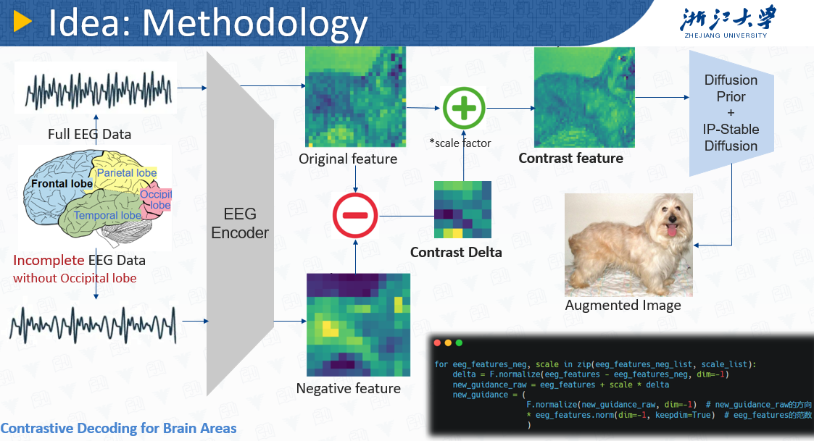
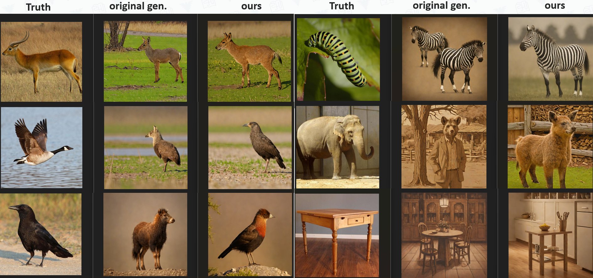
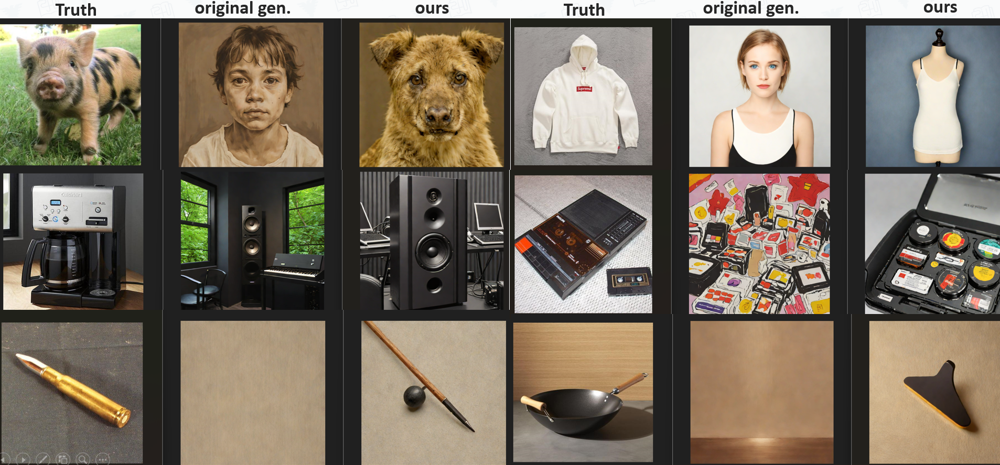
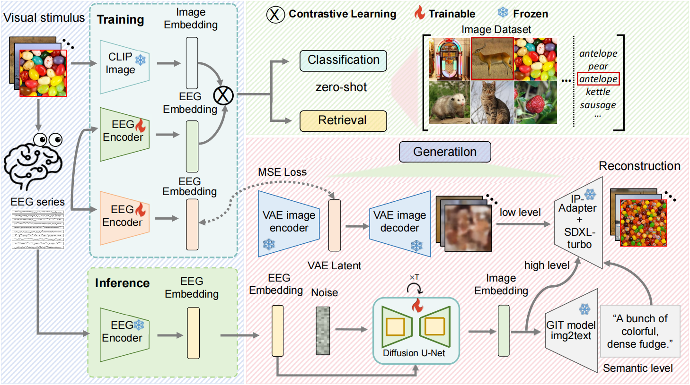
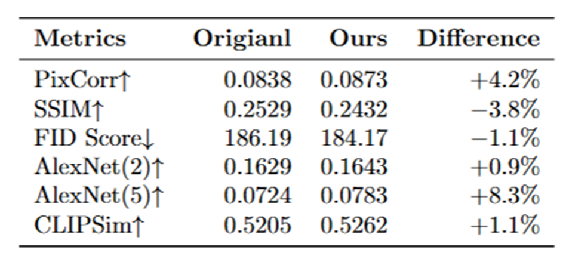

<h2 style="border-bottom: 1px solid lightgray;">🧠EEG2Img-Contrastive-Decoding</h2>

<p align="center">
  <a href="#">
  <p align="center">
    <a href='https://arxiv.org/pdf/2403.07721'></a>
  </p>
</p>



Some examples of using Contrastive Decoding Strategy (using brain area contrast for example) to reconstruct stimulus images basd on EEG:





<h2 style="border-bottom: 1px solid lightgray; margin-bottom: 5px;">🔥Environment setup</h2>

Create a new conda environment and install the required dependencies by running
```+
conda env create -f environment.yml
conda activate EEG-Diffusion
```
<h2 style="border-bottom: 1px solid lightgray; margin-bottom: 5px;">🧩Pre-requisites</h2>

Our work is built upon the foundational research of **Visual Decoding and Reconstruction via EEG Embeddings with Guided Diffusion** (we *reproduce and improve* their training and inference scripts of visual reconstruction). For more details, please refer to the original repository: [ncclab-sustech/EEG_Image_decode ](https://github.com/ncclab-sustech/EEG_Image_decode).

To get started, you will need to download the following resources from their Hugging Face repository:

- **Preprocessed EEG Data** (sub-08 as an example in this repo)
- **Diffusion Prior Weights** (sub-08 as an example in this repo)

These can be accessed here: [Hugging Face Dataset by Lidong Yang ](https://huggingface.co/datasets/LidongYang/EEG_Image_decode). And we provide a download script `tools/prerequisites-download-hf.py`.

W-e provide a script, `EEG-preprocessing/brain_area_eeg_area_filter.py`, to generate negative EEG data by excluding each brain area, which serves as contrastive instances in our research.

The raw EEG dataset, the **training and test images** of relevant **THINGS-EEG dataset** are available on [OSF](https://osf.io/3jk45/).

<h2 style="border-bottom: 1px solid lightgray; margin-bottom: 5px;">🚀 Training</h2>

Base Framework provided by NIPS2024-Visual Decoding and Reconstruction via EEG Embeddings with Guided Diffusion:



❇️Replace `/path/to/EEG2Img-Contrastive-Decoding/` with your own main directory path for all scripts below.

- Run `Generation/train_eeg2clip.py` to train EEG Encoder.
- Run `Generation/train_eeg2vae_latent.py` to train EEG2VAE_Latent Projector. 🤔We retained the training parameters provided in the original work's GitHub repository, but we found that this configuration was unable to successfully train the EEG2VAE_Latent Projector.

- Refer to the `Pre-requisites` section for ready-to-use diffusion prior weights, or train from scratch following the **original** GitHub repository `Generation/Generation_metrics_sub8.ipynb`.
  ```python
  # Example Code to train diffusion prior from scratch
  dataset = EmbeddingDataset(
      c_embeddings=eeg_features_train, h_embeddings=emb_img_train_4, 
  )
  dl = DataLoader(dataset, batch_size=1024, shuffle=True, num_workers=64)
  
  diffusion_prior = DiffusionPriorUNet(cond_dim=1024, dropout=0.1)
  pipe = Pipe(diffusion_prior, device=device)
  
  pipe.train(dl, num_epochs=150, learning_rate=1e-3)
  
  torch.save(pipe.diffusion_prior.state_dict(), "/path/to/save")
  ```

<h2 style="border-bottom: 1px solid lightgray; margin-bottom: 5px;">🚅 Inference</h2>

- Run `Generation/pipeline_eeg2img_onlyCLIP.py` to inference with only Image-CLIP guidance.
  ```shell
  python ./Generation/pipeline_eeg2img_onlyCLIP.py --base_dir "/path/to/EEG2Img-Contrastive-Decoding" --device cuda:0
  ```

- Run `Generation/pipeline_eeg2img_onlyCLIP_contrast_area.py` to inference with brain-area-contrasted Image-CLIP guidance.

  ```shell
  python ./Generation/pipeline_eeg2img_onlyCLIP_contrast_area.py --base_dir "/path/to/EEG2Img-Contrastive-Decoding" --device cuda:0
  ```

- Run `Generation/pipeline_eeg2img.py` to inference with both Image-CLIP and low-level VAE_latent guidance. 🤔Note that low-level VAE_latent guidance maybe not useful as desired.

  ```shell
  python ./Generation/pipeline_eeg2img.py --base_dir "/path/to/EEG2Img-Contrastive-Decoding" --device cuda:0
  ```

<h2 style="border-bottom: 1px solid lightgray; margin-bottom: 5px;">🧪 Evaluation</h2>

- Use `Generation/get_eval_img_tensor.py` to convert generated images into img tensor for evaluation.
- Use `Generation/evaluate.py` to do single run evaluation.
- Use `Generation/evaluate_contrast_area.py` to do evaluation covering all contrastive configurations (i.e. contrast_area and scale factor)

Here is an example results with contrast-Occipital_Area-scale-0.1:



<h2 style="border-bottom: 1px solid lightgray; margin-bottom: 5px;">📁 File Structure</h2>

```text
# File Structure Tree
.
├── 📁 Checkpoints
│   └── 📁 ATMS/
├── 📁 Data
│   ├── 📁 fintune_ckpts/
│   ├── 📁 Preprocessed_data_250Hz/
│   ├── 📄 test_image_latent_512.pt
│   ├── 📁 test_images/
│   ├── 📄 train_image_latent_512.pt
│   ├── 📁 training_images/
│   ├── 📄 ViT-H-14_features_test.pt
│   ├── 📄 ViT-H-14_features_train.pt
│   ├── 📄 ViT-L-14_features_multimodal_test.pt
│   └── 📄 ViT-L-14_features_multimodal_train.pt
├── 📁 eeg_image_reconstruction_results
│   ├── ✨ TO_BE_GENERATED
├── 📁 EEG-preprocessing
│   ├── 📄 brain_area_eeg_area_filter.py
│   ├── 📄 brain_area_idx.py
│   ├── 📄 brain_area_idx.txt
│   ├── 📄 preprocessing.py
│   └── 📄 preprocessing_utils.py
├── 📄 environment.yml
├── 📁 Evaluation
│   ├── ✨ TO_BE_GENERATED
├── 📁 figures
│   ├── ✨ TO_BE_GENERATED
├── 📁 Generation
│   ├── 📄 custom_pipeline_low_level.py
│   ├── 📄 custom_pipeline.py
│   ├── 📄 data_config.json
│   ├── 📄 diffusion_prior.py
│   ├── 📄 evaluate_contrast_area.py
│   ├── 📄 evaluate.py
│   ├── 📄 get_eval_img_tensor.py
│   ├── 📄 loss.py
│   ├── 📄 pipeline_eeg2img_onlyCLIP_contrast_area.py
│   ├── 📄 pipeline_eeg2img_onlyCLIP.py
│   ├── 📄 pipeline_eeg2img.py
│   ├── 📁 subject_layers/
│   ├── 📄 train_eeg2clip.py
│   ├── 📄 train_eeg2vae_latent.py
│   ├── 📄 util.py
│   ├── 📁 utils/
│   └── 📄 utils.py
├── 📁 models
│   ├── ✨ TO_BE_GENERATED
├── 📄 README.md
└── 📁 tools
    ├── 📄 plt_EEGEncoder_train.py
    ├── 📄 prerequisites-download-hf.py
    ├── 📄 view_csv.py
    ├── 📄 view_eeg_data.py
    ├── 📄 view_npy.py
    └── 📄 view_pt.py
```

<h2 style="border-bottom: 1px solid lightgray; margin-bottom: 5px;">References</h2>

This work is based on the following research: 

Li, Dongyang, et al. "Visual Decoding and Reconstruction via EEG Embeddings with Guided Diffusion."  
In *Advances in Neural Information Processing Systems* (NeurIPS 2024), Vol. 37, pp. 102822–102864.  
[[PDF](https://proceedings.neurips.cc/paper_files/paper/2024/file/ba5f1233efa77787ff9ec015877dbd1f-Paper-Conference.pdf)]
